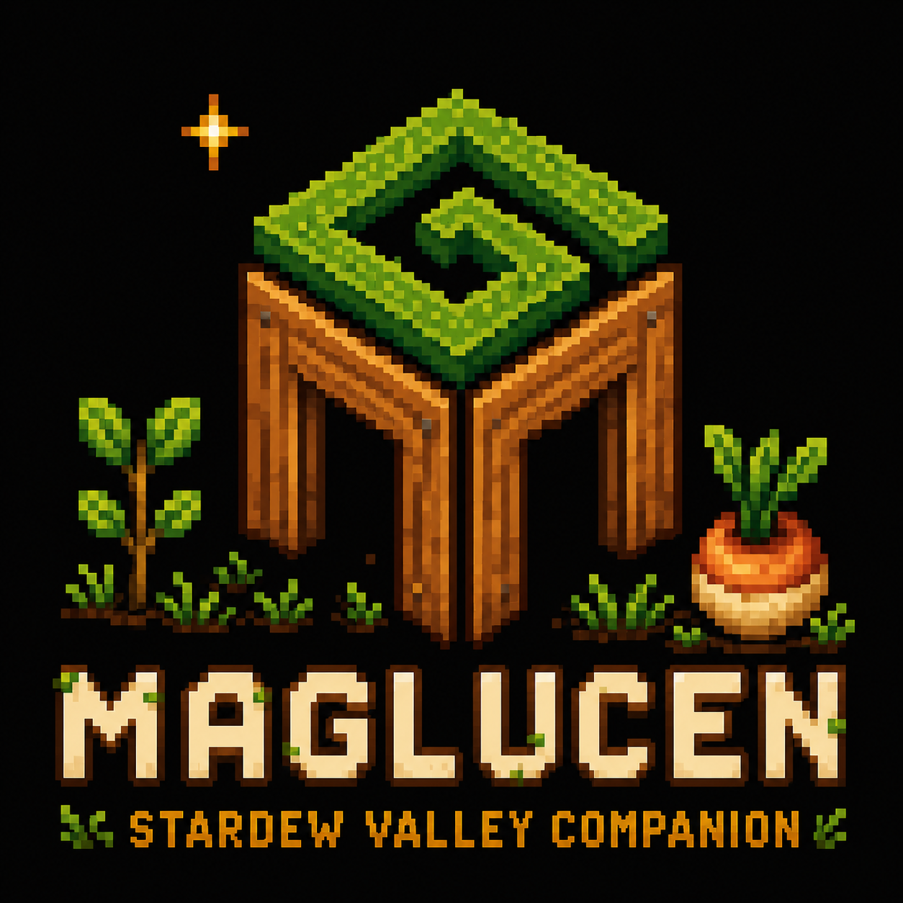

# Maglucen · Stardew Valley Companion

Maglucen Stardew Valley Companion is a local desktop companion for planning and following a farm without editing the save. It reads the player's local save and, when SMAPI is available, updates selected information while the game is running.

## Download

Download the latest Windows installer from [Releases](https://github.com/Maglucen-Studio/StardewValleyTool/releases/latest). Choose the file named `Maglucen-Stardew-Valley-Companion-Setup-<version>.exe`; the `.blockmap` and `latest.yml` files are used by automatic updates.

The application is currently in active development. Release notes describe the changes and any known limitations for each version.

## Main features

- Daily priorities and a location-aware suggested route.
- Fishing availability by season, weather, time, location, and mission.
- Crop, production, friendship, achievement, and Community Center planning.
- Optional LIVE tracking through a bundled SMAPI bridge.
- Local-first operation: farm data stays on the user's computer.

## Requirements

- Windows 10 or Windows 11 (64-bit).
- Stardew Valley for Windows.
- SMAPI only for LIVE tracking; reading saved games does not require SMAPI.

## Privacy

The app processes Stardew Valley save information locally. See [PRIVACY.md](PRIVACY.md) for details.

## Support

Use [GitHub Issues](https://github.com/Maglucen-Studio/StardewValleyTool/issues) for reproducible bugs and feature requests. See [SUPPORT.md](SUPPORT.md) before reporting a problem.

## Disclaimer

Maglucen Stardew Valley Companion is an independent fan-made companion. It is not affiliated with, endorsed by, or sponsored by ConcernedApe or the publishers of Stardew Valley. Stardew Valley names and assets belong to their respective owners.

