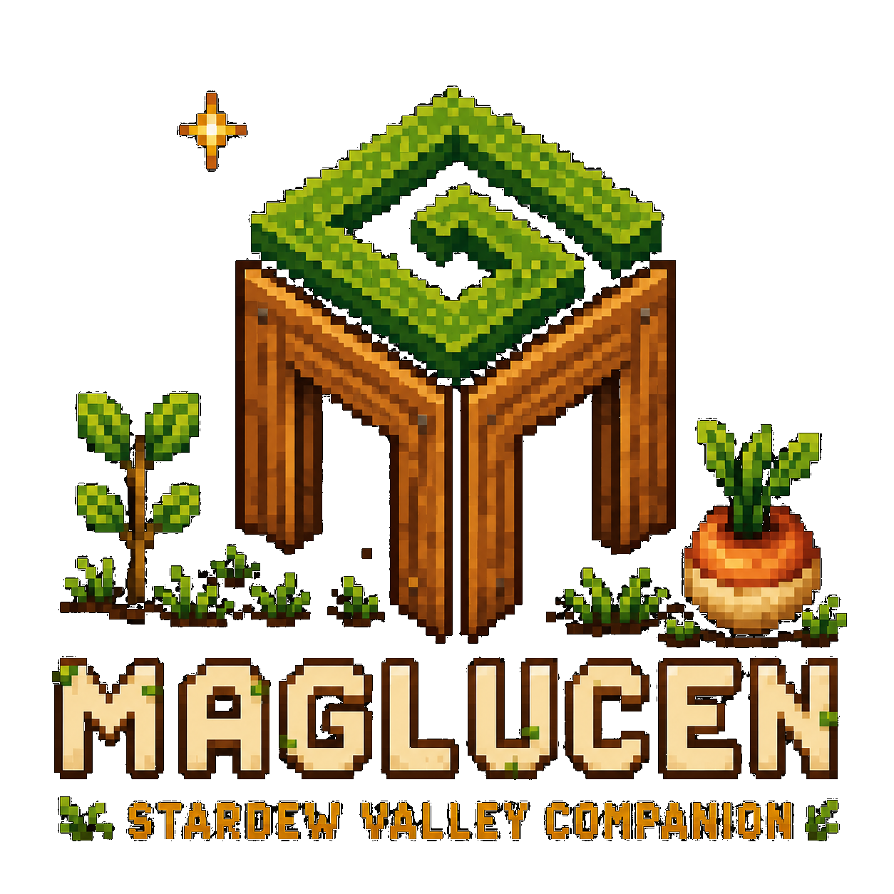

<p align="center">
  
</p>

<p align="center">
  A local-first, open-source desktop companion that turns your Stardew Valley save into a practical daily plan.
</p>

<p align="center">
  <a href="https://github.com/Maglucen-Studio/StardewValleyTool/releases/latest"><strong>Download the latest Windows installer</strong></a>
  ·
  <a href="CHANGELOG.md">Changelog</a>
  ·
  <a href="SUPPORT.md">Support</a>
  ·
  <a href="PRIVACY.md">Privacy</a>
  ·
  <a href="CODE_SIGNING_POLICY.md">Code signing policy</a>
  ·
  <a href="CONTRIBUTING.md">Contribute</a>
</p>

> The application is currently in active development. Its interface follows Stardew Valley's configured language, with complete English and Spanish Companion catalogs in this release. Release notes describe changes and known limitations for each version.

## What it does

- Builds daily priorities and a location-aware suggested route.
- Renders the matching tile-accurate layout for all eight vanilla farm types, with buildings, crops, machines, and interiors drawn from the user's local game installation.
- Shows fish by season, weather, time, location, fishing level, collection status, and active quest.
- Tracks crops, production, friendships, achievements, museum progress, and Community Center bundles.
- Simulates hypothetical crop and fruit-tree investments from locally extracted game rules without requiring SMAPI.
- Reads the current game state through the optional included SMAPI bridge for LIVE updates.
- Processes everything locally and never writes to the Stardew Valley save.

## Install

1. Open [the latest release](https://github.com/Maglucen-Studio/StardewValleyTool/releases/latest).
2. Download **`Maglucen-Stardew-Valley-Companion-Setup-<version>.exe`**.
3. Run the installer and open **Maglucen Stardew Valley Companion**.
4. On first launch, choose your Stardew Valley installation and farm if they are not detected automatically.

The setup assistant checks Steam libraries and common GOG and Xbox locations. It also shows store-specific example paths when manual selection is needed. The application extracts required visual assets from the user's own game installation; Stardew Valley assets are **not** distributed in this repository or its installer.

### Windows security notice

The installer is currently unsigned, so Microsoft Defender SmartScreen may identify it as an unrecognized application or an unknown publisher. Only download it from this repository's official [Releases](https://github.com/Maglucen-Studio/StardewValleyTool/releases) page.

The project is preparing an application for free open-source signing through SignPath. See the [Code signing policy](CODE_SIGNING_POLICY.md) for its signing scope, roles, and mandatory release approval process. This documentation does not mean that the currently published installer is already signed.

Every release includes `SHA256SUMS.txt`. To verify a downloaded installer in PowerShell, run:

```powershell
Get-FileHash .\Maglucen-Stardew-Valley-Companion-Setup-<version>.exe -Algorithm SHA256
```

Compare the resulting hash with the installer entry in `SHA256SUMS.txt`. If they match, the downloaded file is byte-for-byte identical to the installer published by the release workflow. This integrity check does not replace a digital signature, so Windows may still display its warning.

## LIVE tracking

Normal save reading works without SMAPI. For updates while Stardew Valley is running, install [SMAPI](https://smapi.io/) first and let the setup assistant add the included companion bridge to the game's `Mods` folder.

The bridge reports selected live information such as time, location, inventory, quests, route progress, fishing, friendships, bundles, and museum donations. It does not modify game state and it does not install or download SMAPI itself.

## Requirements

- Windows 10 or Windows 11, 64-bit.
- A legitimate PC installation of Stardew Valley 1.6.
- Optional: SMAPI for LIVE tracking.

No separate installation of Python, Node.js, .NET, or a web browser is required.

## Updates

Use **Check for updates** inside the application. It reports whether the installed version is current and, when a newer release is available, can download it and restart the companion to finish installing it. Restarting the companion does not restart or close Stardew Valley.

## Settings and background tracking

Use **Aa → Accessibility** in the dashboard for high contrast, independent text sizing (75–200%), and the replayable quick tour. The map's coordinate controls support keyboard inspection and proposal editing. See the [keyboard and accessibility checklist](app/dashboard/ACCESSIBILITY.md).

Open **Application → Settings…** to configure the farm and two independent background options:

- **Track automatically** starts the companion quietly with Windows and watches for Stardew Valley.
- **Keep running in the system tray** hides the dashboard when its window is closed so tracking can continue. Disable it if closing the window should quit the companion, its tray icon, and its private local service completely.

## Privacy and save safety

- Save data, configuration, extracted assets, logs, and history remain on the user's computer.
- The application reads a private copy of the selected save and never writes to the original.
- No account, cloud upload, analytics service, or hosted dashboard is required.
- See [PRIVACY.md](PRIVACY.md) for the complete privacy summary.

## Support

Use [GitHub Issues](https://github.com/Maglucen-Studio/StardewValleyTool/issues) for reproducible bugs and feature requests. Please read [SUPPORT.md](SUPPORT.md) before opening an issue and include the application version and relevant error message.

## About this repository

This is the canonical source, distribution, and support repository for Maglucen Stardew Valley Companion. Stable installers are built from public tagged source by GitHub Actions. The workflow publishes SHA-256 checksums and a build-provenance attestation with each new release.

The source is available under the [MIT License](LICENSE). See [CONTRIBUTING.md](CONTRIBUTING.md) before proposing changes, [LOCAL_BUILD.md](LOCAL_BUILD.md) for verified local test builds and installers, [CODE_SIGNING_POLICY.md](CODE_SIGNING_POLICY.md) for release-signing governance, [SECURITY.md](SECURITY.md) for private vulnerability reports, [THIRD_PARTY_NOTICES.md](THIRD_PARTY_NOTICES.md) for dependency notices, and [AI_USAGE.md](AI_USAGE.md) for the project's AI-assisted development disclosure.

Stardew Valley assets and game assemblies are deliberately absent. Required images and data are extracted locally from each user's legitimate game installation. Continuous integration compiles the optional SMAPI bridge against public API-only reference assemblies.

## Disclaimer

Maglucen Stardew Valley Companion is an independent fan-made project. It is not affiliated with, endorsed by, or sponsored by ConcernedApe or the publishers of Stardew Valley. Stardew Valley names and assets belong to their respective owners.
